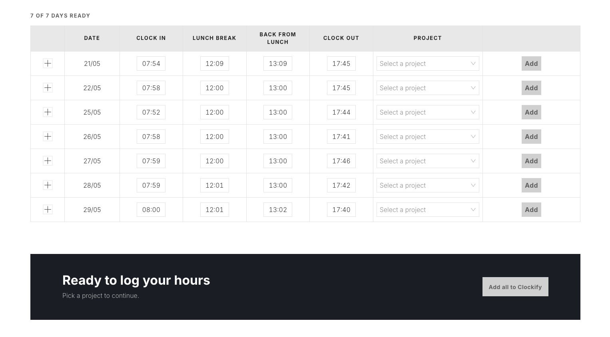

# Clockify Auto

Turn a timesheet screenshot into Clockify time entries, without typing a single hour by hand.

Upload a picture of your company's attendance spreadsheet and a multimodal AI model transcribes every day's four punches (morning in/out, afternoon in/out) into an editable table. Review, fix whatever the OCR got wrong, then push everything to Clockify in one click.

If you don't have a spreadsheet to upload, pick a date range instead and fill in the hours manually — optionally with your GitHub commits shown next to each day, so you can remember what you actually worked on.



## Features

- **Screenshot → timesheet** — OCR a spreadsheet image with Gemini or Claude and get a structured, day-by-day table.
- **CSV import** — parsed locally, no AI key required; map each CSV column to a field (date, clock in, lunch break, back from lunch, clock out) and the table is built in code.
- **Manual date range** — no image needed; generate blank rows for any period (up to 30 days) and type the hours in.
- **GitHub commit context** — connects via OAuth device flow and lists your commits per day, so you can reconstruct a forgotten week.
- **Inline validation** — each row is flagged as ready, invalid (missing pair, end before start) or empty before anything is sent.
- **Bulk or per-row insertion** — apply one Clockify project to every day, or override the project on individual rows.
- **Opt-in key persistence** — API keys live in memory by default; a single switch persists them to `localStorage`, and turning it off wipes them.

## Stack

| Layer | Tech |
|---|---|
| UI | React 19, Ant Design 6, custom CSS design tokens |
| Language | TypeScript |
| Build | Vite 8 |
| AI / OCR | Google Gemini (`@google/genai`), Anthropic Claude (`@anthropic-ai/sdk`) |
| Integrations | Clockify REST API v1, GitHub Search & Device Flow APIs |
| Dates | Day.js + local date utilities |
| Hosting | Vercel (serverless functions + SPA rewrites) |

State is organized as view-model hooks (`useReport`, `useClockify`, `useGitHub`) consumed by presentational components — no external state library.

## Getting started

```bash
npm install
npm run dev
```

Create a `.env` file for the GitHub integration:

```env
VITE_GITHUB_CLIENT_ID=your_github_oauth_app_client_id
```

The Gemini, Claude and Clockify keys are entered in the UI at runtime — they are never bundled.

### Scripts

| Command | What it does |
|---|---|
| `npm run dev` | Start the Vite dev server |
| `npm run build` | Type-check and build for production |
| `npm run preview` | Serve the production build locally |
| `npm run lint` | Run ESLint |

## How it works

1. **Source** — one of three. An image is base64-encoded in the browser and sent to the selected model with a strict JSON-only prompt. A CSV is parsed in the browser with papaparse (delimiter auto-detected), columns are auto-mapped by header name and can be overridden by hand. Or rows are generated blank from a date range. The first two go through the same normalization (`DD/MM`, `DD/MM/YYYY` or ISO → ISO dates, deduplicated, sorted).
2. **Review** — the table renders one row per day with four editable time cells, a validity badge, and (when GitHub is connected) that day's commits.
3. **Insert** — valid rows become Clockify time entries: one entry per filled morning/afternoon pair, posted to the chosen workspace and project.

GitHub's device flow requires a server-side token exchange, handled by two serverless functions under `api/github/` and routed by `vercel.json`.

## Notes

- Requests to Gemini, Claude and Clockify go straight from the browser, so keys stay on your machine — but they are exposed to that page's runtime. Use scoped keys.
- Commit lookup uses the GitHub Search API, which caps at 1000 results and is rate-limited per user.
- Date ranges are limited to 30 days per report.
